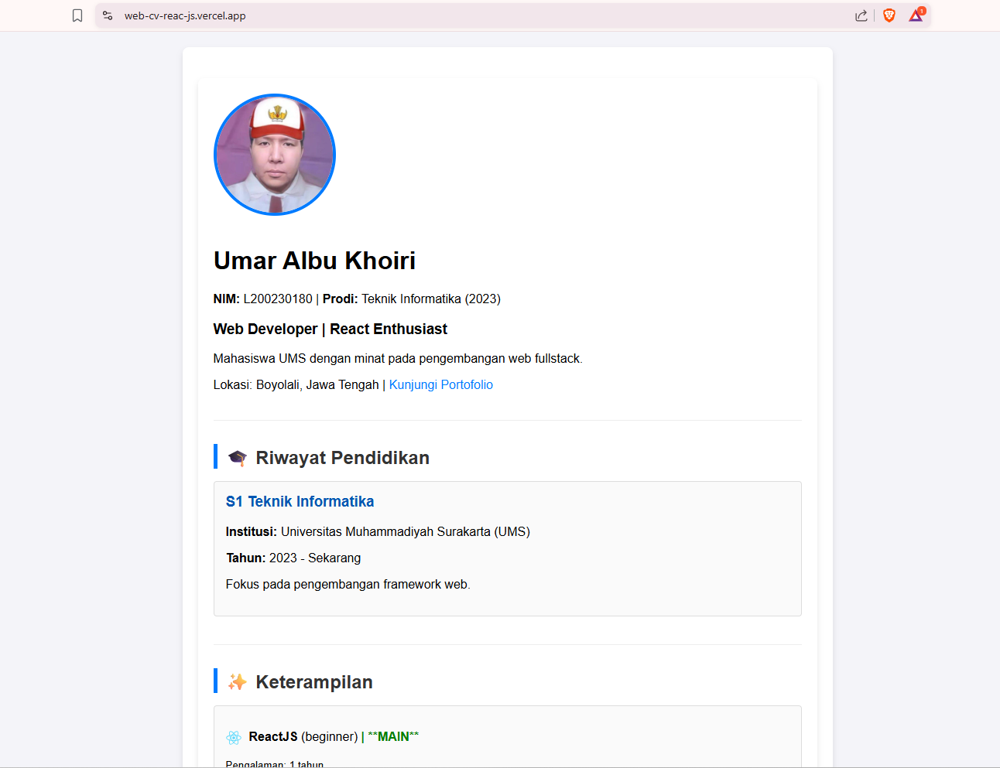
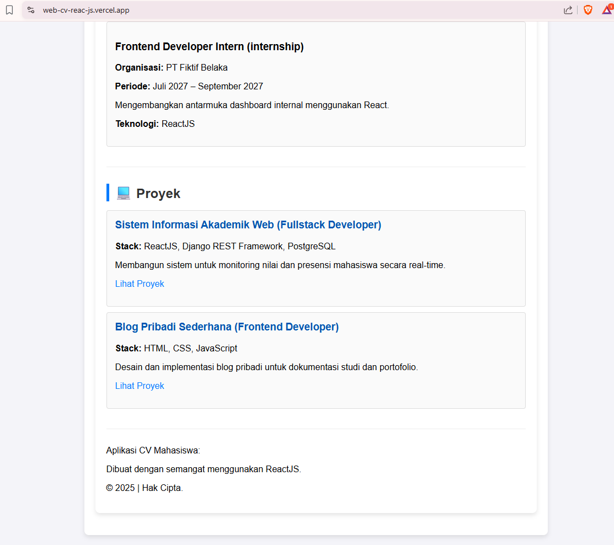

# 📄 Dokumentasi Aplikasi CV Mahasiswa Berbasis ReactJS

Aplikasi ini adalah **Single Page Application (SPA)** interaktif yang dibangun menggunakan **ReactJS**.  
Aplikasi ini dirancang untuk menampilkan *Curriculum Vitae (CV)* atau profil portofolio seorang mahasiswa secara modern dan terstruktur.

Aplikasi ini bersifat **modular**, memisahkan setiap bagian CV (Profil, Pendidikan, Keterampilan, Pengalaman, Proyek) ke dalam komponen React terpisah, serta menggunakan **data JSON** sebagai sumber informasi tunggal sehingga mudah diperbarui.

---

## ✨ Fitur Utama

### 1. Struktur Modular  
Setiap bagian CV (Profile, Education, Skills, Experiences, Projects) merupakan komponen React terpisah sehingga mudah dikelola dan diperbarui.

### 2. Data Driven  
Semua data diambil dari file konfigurasi **dataMahasiswa.json**, memungkinkan pembaruan konten tanpa perlu mengubah logika komponen.

### 3. Desain Responsif  
Menggunakan **Tailwind CSS** untuk styling yang cepat, modern, dan responsif sehingga terlihat baik di berbagai ukuran layar (desktop, tablet, mobile).

### 4. Footer Menarik  
Aplikasi dilengkapi dengan footer yang informatif dan menarik.

---

## 🛠 Cara Menjalankan Aplikasi

Aplikasi ini dibangun menggunakan React dan biasanya diinisialisasi melalui Vite atau Create React App (CRA).

### **Prasyarat**
Pastikan Anda sudah menginstal:

- **Node.js & npm/Yarn** – lingkungan runtime JavaScript  
- **Git** *(opsional, untuk manajemen versi)*

---

## 🚀 Langkah-langkah Instalasi & Menjalankan

### 1. Clone atau Unduh Proyek
Jika menggunakan Git:

```bash
git clone [Link Repository Proyek Anda]
cd [Nama Folder Proyek]

2. Instal Dependensi
npm install
# ATAU
yarn install

3. Jalankan Aplikasi
npm run dev
# ATAU
yarn dev

Aplikasi akan berjalan di:
http://localhost:5173/

🔗 Link Deployment
Link Aplikasi:

[Link Aplikasi](https://web-cv-reac-js.vercel.app/)

🖼 Screenshot Tampilan


🖼 Screenshot Tampilan
